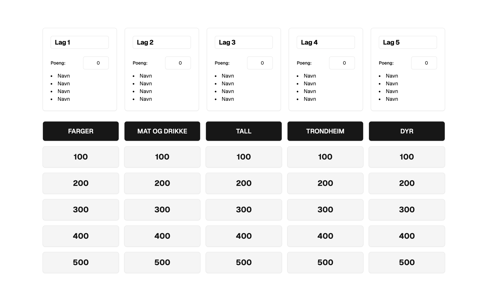

# jeopardy



## Endre/legge til spørsmål:

Endre på kategorier: `src/components/jeopardy-board.tsx`
Endre på lag: `src/components/jeopardy-teams.tsx`

## Kjøring

```shell
npm i
npm run dev
```

## Viktig info

Alt lagres i local storage i browseren så hvis ting krasjer og er vrient må man manuelt gå inn og slette det som er der.


